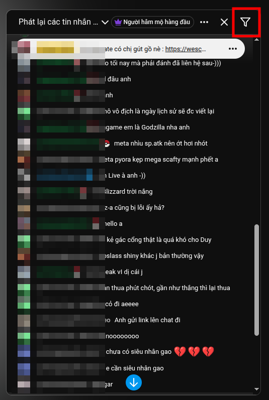
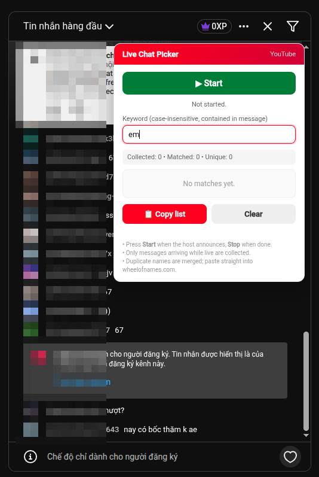
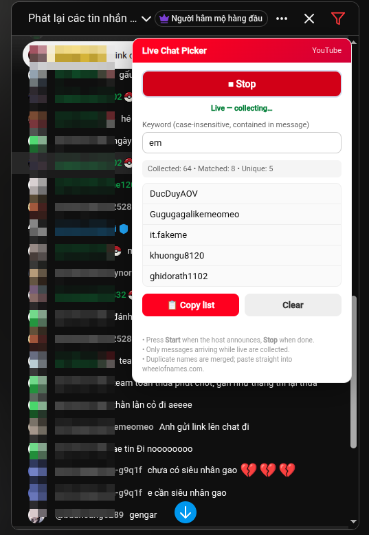

# Live Chat Picker

> 🇻🇳 [Tiếng Việt](#tiếng-việt) · 🇬🇧 [English](#english)

---

## Tiếng Việt

### Giới thiệu

**Live Chat Picker** là extension Chrome (Manifest V3) giúp **lọc tin nhắn trong
livestream YouTube theo từ khoá** rồi xuất danh sách **tên người chat** để dán
thẳng vào trang quay số [wheelofnames.com](https://wheelofnames.com) — dùng cho
minigame giveaway.

Extension đọc DOM live chat trực tiếp, **không dùng YouTube Data API**, không cần
đăng nhập hay OAuth. Theo dõi tin nhắn theo thời gian thực (mutation observer),
và có nút **Scan chat** tự cuộn về đầu replay đẻ tải thêm tin cũ (khoảng dưới 30 phút).

### Cách cài đặt

1. Tải file `live-chat-picker-v1.0.0.zip` từ repo này về máy (nút **Download**
   trên GitHub).
2. **Giải nén** file `.zip` ra một thư mục bất kỳ (vd `live-chat-picker`).
3. Mở `chrome://extensions`.
4. Bật **Developer mode** (góc trên phải).
5. Bấm **Load unpacked** → chọn thư mục vừa giải nén (thư mục chứa
   `manifest.json` ở cấp gốc).
6. Mở trang livestream YouTube (hoặc cửa sổ popout chat
   `youtube.com/live_chat?v=...`).

### Cách dùng

Một icon **phễu (filter)** sẽ xuất hiện trong thanh tiêu đề của khung chat
(nằm cạnh các nút mặc định của YouTube, cùng hàng với "Người hâm mộ hàng đầu").

1. **Bấm vào icon phễu** → mở bảng điều khiển **Live Chat Picker**.
2. Gõ **từ khoá** vào ô keyword (vd: `em`). Việc lọc theo *contain*,
   không phân biệt HOA/thường — tin `"em đi không"`, `"anh em"`, `"system"` đều
   khớp nếu từ khoá là `em`.
3. Bấm **🔍 Scan chat** để:
   - Bắt tin nhắn đang hiển thị trong viewport, và
   - Tự cuộn về đầu replay để tải tin cũ (khoảng dưới **30 phút**).

   Khi đang scan, nút hiện `⏳ Scanning…` (vô hiệu hoá), icon phễu ở header **đổi sang màu đỏ**.

   

4. Khi scan xong → nút trở lại `🔍 Scan chat`, status hiện `Done — N messages`.
   (Tin nhắn mới đến sau đó cũng được tự bắt, không cần bấm lại.)
5. Bấm **📋 Copy list** → danh sách tên (mỗi tên một dòng) được copy vào clipboard.
6. Sang [wheelofnames.com](https://wheelofnames.com) → paste vào ô nhập tên
   → bấm quay.

### Các thành phần trên bảng điều khiển

| Thành phần | Ý nghĩa |
|---|---|
| **🔍 Scan chat** | Bắt tin nhắn hiện có + tự cuộn về đầu replay để tải tin cũ (tối đa ~30 phút). Observer luôn bắt tin mới đến sau đó. |
| **Keyword** | Từ khoá lọc, không phân biệt hoa thường, so khớp trong nội dung tin (contain). Ô rỗng = không khớp gì cả. |
| **Collected / Matched / Unique** | Tổng tin đã thu / số tin khớp từ khoá / số tên (đã gộp trùng) duy nhất. |
| **Copy list** | Sao chép danh sách tên (mỗi tên 1 dòng). |
| **Clear** | Xoá dữ liệu đã thu thập. tin đã xử lý trước đó *không* được thêm lại. |
| **Danh sách** | Cuộn tự động xuống cuối khi có tên mới; nếu bạn đang cuộn lên xem tên cũ thì sẽ không bị giật xuống. |

### Lưu ý

- Bấm **Scan chat** để tải tin cũ. YouTube là **virtualized list** (chỉ giữ tin gần viewport) nên việc cuộn về đầu là cần thiết để observer bắt đủ tin cũ.
- Tên người gửi được tự động **gộp trùng** (phân biệt theo lowercase, bỏ tiền tố
  `@`) → một user comment nhiều lần vẫn chỉ tính 1 tên.
- Emoji / huy hiệu không được lấy (chỉ lấy text nội dung).
- Tin Super Chat / membership vẫn được đếm nếu có tên + nội dung.
- Cấu hình từ khoá được lưu vào `localStorage` của trình duyệt, nhớ lại khi mở lại.

---

## English

### Overview

**Live Chat Picker** is a Chrome extension (Manifest V3) that **filters messages
in a YouTube livestream by keyword** and exports the list of participant
**display names**, ready to paste into [wheelofnames.com](https://wheelofnames.com)
for giveaways / minigames.

It reads the live chat DOM directly — **no YouTube Data API, no login, no OAuth**.
Watches incoming messages live (mutation observer), and a **Scan chat** button
auto-scrolls to the top of the replay to load older messages (~up to 30 minutes).

### Install

1. Download `live-chat-picker-v1.0.0.zip` from this repo (the **Download**
   button on GitHub).
2. **Unzip** the `.zip` to any folder (e.g. `live-chat-picker`).
3. Open `chrome://extensions`.
4. Enable **Developer mode** (top right).
5. Click **Load unpacked** → select the unzipped folder (the one containing
   `manifest.json` at its root).
6. Open a YouTube livestream (or the popout chat window
   `youtube.com/live_chat?v=...`).

### Usage

A **filter (funnel) icon** appears in the live chat header, next to YouTube's
default controls (same row as "Top fan" badge).

1. **Click the filter icon** to open the **Live Chat Picker** panel.
2. Type a **keyword** (e.g. `em`). Matching is *contains*, case-insensitive —
   `"em đi không"`, `"anh em"`, `"system"` all match if the keyword is `em`.
3. Click **🔍 Scan chat** to:
   - Capture currently visible messages, and
   - Auto-scroll to the top of the replay to load older messages (~up to 30 min).

   While scanning, the button reads `⏳ Scanning…` (disabled); the header filter icon turns **red**.

   

4. When done → button reverts to `🔍 Scan chat`, status shows `Done — N messages`.
   (New messages arriving afterwards are also captured automatically — no need to re-scan.)
5. Click **📋 Copy list** to copy the list of names (one per line) to clipboard.
6. Go to [wheelofnames.com](https://wheelofnames.com) → paste into the entry box → spin.

### Panel reference

| Element | Meaning |
|---|---|
| **🔍 Scan chat** | Captures visible messages + auto-scrolls to the top of the replay to load older ones (max ~30 min). The background observer keeps capturing new messages afterwards. |
| **Keyword** | Filter keyword (case-insensitive, contained in message). Empty = no matches. |
| **Collected / Matched / Unique** | Total collected / matched keyword / unique names (deduped). |
| **Copy list** | Copy the name list (one per line) to clipboard. |
| **Clear** | Wipe collected data. Already-processed messages are *not* re-collected. |
| **List** | Auto-scrolls to bottom when new names arrive; if you scroll up to read older names, it won't yank you back down. |

### Notes

- Press **Scan chat** to load old messages. YouTube uses a **virtualized list** (only keeps messages near the viewport), so scrolling to the top is necessary for the observer to capture older ones.
- Author names are **auto-deduped** (case-insensitive, `@` prefix stripped) —
  a user commenting multiple times still counts as one name.
- Emoji / badges are not captured (text content only).
- Super Chat / membership messages still count if they have author + content.
- The keyword is saved to browser `localStorage` and remembered on reopen.

---

## Files

- `manifest.json` — Manifest V3 declaration; content script on
  `youtube.com/watch`, `/live`, `/live_chat` and `music.youtube.com/watch`.
- `content.js` — All logic + UI (Shadow DOM panel, header injection).
- `images/` — Screenshots used in this README.